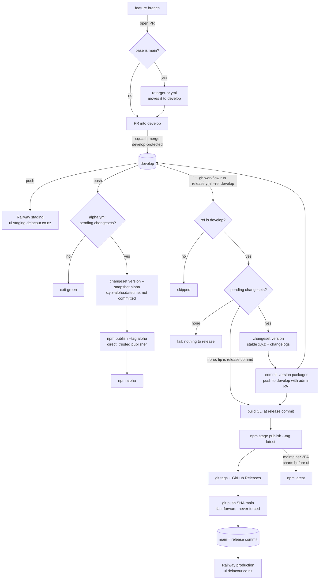

# Delacour UI — Monorepo

A Bun workspace holding `@delacour/react-native-ui`, a React Native component library,
and the Expo app that renders it. Nothing here ships to a user; the library is
the product.

## Workspaces

| Path | Package | What it is |
| --- | --- | --- |
| `packages/react-native-ui` | `@delacour/react-native-ui` | **The product.** A React Native component library. Ships raw `.tsx`, no build step |
| `packages/react-native-charts` | `@delacour/react-native-charts` | The headless charting engine `react-native-ui`'s `Chart` skins — Skia, no tokens, no `className` |
| `packages/design-system` | `@delacour/design-system` | The customizer's axes, the resolver, the preset codec and the CSS emitters |
| `packages/cli` | `delacour` | The CLI that copies the library's source into someone else's repo, and the builder for the `registry/` it reads |
| `apps/playground` | `@delacour/playground` | Expo app — the library's harness and gallery |
| `apps/web` | `@delacour/web` | The documentation site — TanStack Start + Fumadocs, deployed on Railway |
| `packages/biome-config` | `@delacour/biome-config` | Lint and format rules, for everything |
| `packages/brand` | `@delacour/brand` | The Delacour mark — master art plus the geometry every rendering reads |
| `packages/skills` | `@delacour/skills` | The agent skill the CLI installs and the docs site serves |
| `packages/tsconfig` | `@delacour/tsconfig` | Shared TypeScript configs |
| `packages/types` | `@delacour/types` | Shared utility types — `Result` and its constructors |

Each has its own `AGENTS.md`. **Read the one for the package you are editing** —
`packages/react-native-ui/AGENTS.md` is the substantial one, and it indexes a further
file per component.

## Commands

Run from the repo root; turbo fans each out across every workspace.

```bash
bun install                # postinstall wires the prek hooks
bun run dev                # turbo dev — the playground, in practice
bun run typecheck          # tsc --noEmit everywhere
bun run check              # Biome lint + format
bun run lint               # lint only
bun run fmt                # format only
bun test                   # unit tests
bun run previews           # recapture component preview media from a simulator
bun run nuke               # delete every node_modules and reinstall from scratch
```

Two generators live in the apps rather than at the root, because each writes into its own
workspace. Both read `packages/brand` and both commit their output:

```bash
cd apps/playground && bun run icons   # launcher, adaptive and tinted app-icon PNGs
cd apps/web        && bun run icons   # favicons, PWA icons, apple-touch-icon
```

`previews` is the odd one out: it drives an iOS simulator, so it needs a Mac with Xcode and it is
deliberately **not** part of `build`. Its output — `apps/web/public/previews/**` and
`apps/web/src/previews/manifest.ts` — is committed, which is what lets the docs site deploy on a
machine with no simulator. See [apps/playground/AGENTS.md](apps/playground/AGENTS.md#capturing-preview-media).

Turbo caching is **off** for every task but `build` (`cache: false` in
`turbo.jsonc`), so a run always reflects the tree as it is now.

## Branches

Two long-lived branches, and they move differently:

| Branch | Holds | Moves by |
| --- | --- | --- |
| `develop` | Everything merged — where work lands | A squash-merged pull request, or the release commit `release.yml` pushes |
| `main` | The last release — the repository's default branch and front page | `release.yml` fast-forwarding it to the commit it released |

`main` is the default branch so that anyone reaching the repository sees what was last published.
GitHub also offers the default branch as the base of every new pull request, and it has no setting
to offer a different one, so `.github/workflows/retarget-pr.yml` moves any pull request opened
against `main` to `develop`. Open against `develop` in the first place — `gh pr create --base develop`,
or `git config branch.<name>.gh-merge-base develop` once per branch — and branch off `origin/develop`,
not `main`.

`.github/rulesets/develop.json` (`develop-protected`) is the merge gate: it blocks force-pushes and
deletion, requires linear history, and requires a pull request whose four CI checks are green, whose
review threads are resolved, and whose branch is up to date with `develop`. Squash is the only merge
method.

`.github/rulesets/main.json` (`main-protected`) is release-only: it blocks deletion and non-fast-forward
pushes, requires linear history, and restricts updates to its bypass list — repository admins. There
is no pull request rule on it, because nothing reaches `main` by pull request. The one routine update
is the release job's fast-forward, made with `RELEASE_TOKEN`, which is why that token has to belong to
an admin. Because `develop` only takes squash merges and release commits and `main` only fast-forwards,
`main` is always an ancestor of `develop`; a hand-made commit on `main` breaks that, and the next
release then fails at the push.

Approvals are **not** required — a sole maintainer cannot approve their own pull request — so the
gate is CI plus resolved conversations. A worktree is therefore a feature branch: opening a pull
request is the only way in. Repository admins can bypass in an emergency, and the audit log records
it when they do.

Because the branch must be up to date, `gh pr merge --auto` waits on a stale branch rather than
rebasing it. Press **Update branch**, or rebase, to clear it.

GitHub does not apply the rulesets from those files; the files are the reproducible copy of what was
applied. To change protection, edit the JSON, apply it, and commit both in the same change:

```bash
REPO=delacournz/delacour-ui
for NAME in main develop; do
  ID=$(gh api "repos/$REPO/rulesets" --jq ".[] | select(.name==\"$NAME-protected\") | .id")
  gh api --method PUT "repos/$REPO/rulesets/$ID" --input ".github/rulesets/$NAME.json"
done
```

## CI

`.github/workflows/ci.yml` runs four jobs in parallel on every pull request and on every push to
`develop` — `typecheck`, `check (lint + format)`, `test`, `build` — in about a minute.

It does not run on push to `main`. `main` only ever fast-forwards to a commit already on `develop`,
whose push run checked that exact SHA, so a run there would only repeat it. Railway does not wait on
check suites, so no deploy depends on one either.

Every job runs on a [Namespace](https://namespace.so) runner, never a GitHub-hosted label:
`namespace-profile-linux-small` for Linux work, `namespace-profile-mac-small` for any job that
needs macOS (Xcode, a simulator), and `namespace-profile-windows-small` for any job that needs
Windows. Nothing needs macOS or Windows today, so those two profiles are unused.
The `ubuntu-latest` / `macos-*` / `windows-*` labels are not to be reintroduced — with one exception, below.

The exception is the `release` job in `release.yml`, which stays on `ubuntu-latest`. npm's trusted
publishing generates a sigstore provenance attestation and verifies it against the runner, and
sigstore only attests GitHub-hosted runners: on a Namespace runner every `npm stage publish` fails
with `E422 … Unsupported GitHub Actions runner environment: "self-hosted"`. Moving it back to
Namespace means either `--provenance=false` (OIDC without the attestation) or an npm token, and
neither is worth one short job per release.

All four are required status checks on `develop`, which makes the job `name:` values an API contract:
they appear verbatim in `.github/rulesets/develop.json` and GitHub matches them by string. Rename a job
without updating that file and every pull request blocks forever on a check that never reports.

For the same reason the workflow carries no `paths:` filter and no draft skip. A check that is
skipped is not a check that passed — it is a pull request that can never be merged.

Socket Security posts two further checks. They stay advisory on purpose: requiring a third-party app
would couple the merge gate to a vendor's uptime.

## Dependency versions

Shared native and React versions are pinned once, in the root `package.json`
`workspaces.catalog`, and referenced as `catalog:` from each package:

```
@legendapp/list  @shopify/react-native-skia 2.6.2  react 19.2.3  react-native 0.86.2
react-native-gesture-handler ~2.32.0  react-native-keyboard-controller  react-native-reanimated 4.5.1
react-native-safe-area-context ~5.7.0  react-native-screens ~4.26.0  react-native-svg 15.15.4
react-native-worklets 0.10.1
```

Every version here is the one Expo SDK 57 bundles. That is the rule, not a coincidence: `expo
install` and `expo-doctor` both check against it, and a native module a minor ahead of the SDK
fails at the linker rather than at install.

`@types/react` is catalogued for the same reason a native module is, and it was added after the
proof: four packages declared three different ranges (`^19.2.0`, `~19.2.2`, `^19.2.18`), so two
copies were always installed and only bun's hoisting order decided which one landed at the root.
Rename a package and that order changes — `packages/react-native-ui` then compiled against a different
`@types/react` from the app, every `ComponentRef<typeof Animated.View>` collapsed to `never`, and
`tsc` blamed `pressable.tsx`.

**Bump a version in the catalog, never in a package.** Two versions of a native
module register twice and break at runtime — which is also why `react-native-ui`
declares every native module as a **peer** dependency rather than a dependency.

## `linker = "hoisted"` is load-bearing

`bunfig.toml` sets it, and Metro is the reason:

> Metro resolves modules by walking `node_modules` directories and cannot see
> through Bun's default isolated layout (packages hidden under
> `node_modules/.bun`). A hoisted, flat `node_modules` is what React Native
> tooling expects; without this, Metro fails to resolve `@expo/metro-runtime`
> and the bundle never builds.

Do not remove it, and do not switch a package to an isolated install. Even
hoisted, Bun materialises a second copy of some native modules under the app,
which is why `apps/playground`'s `metro.config.js` pins nine of them to the
workspace-root copy and its `tsconfig.json` pins `react-native` the same way.

## `trustedDependencies`

`@shopify/react-native-skia` is the one package whose lifecycle scripts Bun is allowed to run. Its
`postinstall` copies the prebuilt `.xcframework`s out of `react-native-skia-apple-ios` into its own
`libs/`; blocked, the iOS build fails at link time with no framework to find. Bun blocks postinstall
scripts by default, so the package is named in `trustedDependencies` in the root `package.json`.

## Releases

Three packages reach npm — `delacour` (the CLI), `@delacour/react-native-ui` and `@delacour/react-native-charts`.
Everything else in the workspace is `private: true`, which is the only thing stopping
`changeset publish` from putting `@delacour/tsconfig` and friends on the registry the first time
it runs.

**Libraries are scoped; the CLI is not.** The `@delacour` org on npm is ours, so every library that
publishes lives under it, named for what a consumer installs rather than for its workspace folder —
`packages/react-native-ui` publishes as `@delacour/react-native-ui`, because the thing in the import is
React Native and the folder name is an internal detail nobody types. The CLI stays the bare `delacour` because it is typed, not imported:
`bunx delacour add button` is the whole point of it. Moving a private package to published needs no
rename, only `private: true` removed and the manual first publish below.

The two libraries were published as `delacour-react-native-ui` and `delacour-react-native-charts`
while the org belonged to someone else. Those names are deprecated on npm with a pointer here and
take no further versions — do not publish to them.

`@delacour/react-native-charts` is public because it has to be: `react-native-ui` ships raw `.tsx`, so the
`import … from "@delacour/react-native-charts"` in `chart.tsx` is in the published tarball and gets resolved by
a stranger's Metro. It is an **optional peer** of `react-native-ui` rather than a dependency — a
dependency may be nested, two copies mean two chart contexts, and a correctly-nested
`<Chart.Line>` then throws "must be used inside a `<Chart>`" from inside a `<Chart>`.

Releases are driven by [Changesets](https://github.com/changesets/changesets). A change that
should ship adds one:

```bash
bun run changeset          # pick packages, pick a bump, describe it
```

Commit that markdown file alongside the change. From there the packages ship on two lines, from two
workflows:

| Line | npm dist-tag | Version | Published by | When |
| --- | --- | --- | --- | --- |
| alpha | `alpha` | `x.y.z-alpha.<datetime>` | `.github/workflows/alpha.yml` | Every push to `develop` that carries a pending changeset |
| stable | `latest` | `x.y.z` | `.github/workflows/release.yml` | By hand: `gh workflow run release.yml --ref develop` |

### The flow

```
 feature/*                  develop                                    main (default branch)
 ─────────                  ───────                                    ─────────────────────
                               │                                             │
  PR opened ──► base = main? ──┤ retarget-pr.yml moves it to develop         │
                               │                                             │
  squash merge ──────────────► ● develop-protected: 4 checks, up to date     │
  (+ .changeset/*.md)          │                                             │
                               │ push                                        │
                               ▼                                             │
                 ┌───────────────────────────────────┐                       │
                 │ alpha.yml                         │                       │
                 │ no pending changeset → exit green │                       │
                 │ changeset version --snapshot alpha│                       │
                 │   (x.y.z-alpha.<datetime>,        │                       │
                 │    never committed)               │                       │
                 │ npm publish --tag alpha  (direct) │──► npm  @alpha        │
                 └───────────────────────────────────┘                       │
                               │                                             │
                    … more merges, more alphas …                             │
                               │                                             │
  gh workflow run release.yml --ref develop                                  │
                               ▼                                             │
                 ┌───────────────────────────────────┐                       │
                 │ release.yml                       │                       │
                 │ 1. ref != develop → skipped       │                       │
                 │ 2. nothing pending → fail         │                       │
                 │    (tip is a release commit →     │                       │
                 │     resume from step 5)           │                       │
                 │ 3. changeset version → x.y.z      │                       │
                 │ 4. commit "version packages",     │                       │
                 │    push to develop (admin PAT) ───┼──► ● release commit   │
                 │ 5. build CLI at that SHA          │    │ (alpha.yml: none  │
                 │ 6. npm stage publish --tag latest │    │  pending → skip)  │
                 │ 7. git tags + GitHub Releases     │                       │
                 │ 8. git push SHA:main ─────────────┼──── fast-forward ────►● = release commit
                 └───────────────────────────────────┘                       │
                               │                                             ▼
                               ▼                                   Railway production
                 maintainer, with 2FA:                             ui.delacour.co.nz
                 npm stage approve <id>
                 (charts before ui) ──────────────────────► npm  @latest

  every push to develop ──► Railway staging  ui.staging.delacour.co.nz
```



### Alpha: every merge

`alpha.yml` runs `.github/changeset-alpha.ts` on every push to `develop`. With no pending changeset
it exits green — a docs-only merge, or the release commit itself. Otherwise it runs
`changeset version --snapshot alpha`, which gives every package a pending changeset names (and its
dependents) the version the next release would give it plus an `-alpha.<datetime>` suffix —
`useCalculatedVersion` and `prereleaseTemplate` in `.changeset/config.json` set that shape. The
suffix is a 14-digit number, so each snapshot sorts after the one before it. The bump is never
committed: the runner's tree is thrown away, and the changesets stay pending for the release.

Each unpublished snapshot then goes to npm with `npm publish --tag alpha`, directly. `latest` is
never touched. No git tag and no GitHub Release is cut: a snapshot is a build, not a release.

After a stable release `alpha` still names the last snapshot, which is older than the new
`latest`, until the next merge with a changeset publishes a new one.

### Stable: by hand

`release.yml` has no push trigger. Run it on `develop` when the alphas are right:

```bash
gh workflow run release.yml --ref develop
```

It runs `changeset version` for real, consuming every pending changeset into stable versions and
changelogs, and pushes the result to `develop` as **🔖 chore(release): version packages** — a direct
push, which `RELEASE_TOKEN` makes as an admin bypassing `develop-protected`. The alphas published
from those changesets are what reviewing the versions looks like, so there is no version pull
request. The CLI is built with its registry ref pinned to that commit, every unpublished package is
staged on `latest`, the tags are pushed, a GitHub Release is cut per package, and `main` is
fast-forwarded to the release commit.

A run from any other branch is skipped. A run with nothing pending fails, unless `develop`'s tip is
already a release commit — an earlier run pushed it and then failed — in which case it resumes at
the build, and the stage script counts an already-staged version as success. The push to `develop`
fails if a merge landed during the run; run it again. The fast-forward is the last step and is never
forced: if `main` has diverged the push is refused, and once `main` is reconciled a re-run resumes.

Fast-forwarding `main` is also what deploys `ui.delacour.co.nz`, so the production docs move with
each release and not with each merge. It lands before the staged versions are approved; approve them
promptly, or the site documents a version `latest` does not serve yet.

The action is `changesets/action@v2`, used for its publish half only: the release commit consumed
every changeset, so it goes straight to `publish-script`, then pushes the tags that script wrote and
cuts the Releases. v2 rather than v1 because `@changesets/cli` 3 files the changesets a pre-mode
`changeset version` consumes under `.changeset/pre/`, and v1 read that directory as a Changesets-v1
changeset and died on `.changeset/pre/changes.md`.

### Leaving pre mode

The packages were published as `0.1.0-alpha.N` from Changesets **pre mode**, which cannot coexist
with snapshots (`changeset version --snapshot` refuses to run in it). `.changeset/pre.json` is
therefore in mode `exit`: snapshots work, and the first stable release versions `0.1.0`, folds the
changesets under `.changeset/pre/` into its changelog, and deletes `pre.json` and `pre/`. Do not
delete them by hand before then — they are that changelog.

### The CLI follows its own line

A CLI reads the registry at the commit it was built from, so an alpha CLI can hand over components
that use an API only the alpha packages have. `packages/cli/src/project/channel.ts` reads the CLI's
own version: an `-alpha` build installs Delacour packages as `@alpha`, a stable one installs them
untagged from `latest`. The documented commands are `bunx delacour@latest` and a bare
`bun add @delacour/react-native-ui`; `@alpha` is how a consumer opts into the snapshot line.

### npm authentication

**Both workflows authenticate with OIDC — there is no npm token.** Each package has two trusted
publishers on npmjs.com, bound to this repository and a workflow filename:

| Workflow | Allowed action | Why |
| --- | --- | --- |
| `alpha.yml` | `npm publish` | An alpha on every merge cannot wait for 2FA |
| `release.yml` | `npm stage publish` only | A stable version reaches `latest` only after a maintainer approves it |

The binding is the filename: rename either workflow and its publishes are refused until the
publisher is recreated. `release.yml` therefore does not run `changeset publish` — that shells out
to `npm publish`, and the registry answers `E403 OIDC permission denied for this action`. It runs
`.github/changeset-stage.ts` instead, which asks Changesets for the publish plan, runs
`npm stage publish` in each unpublished package, writes the stage ids to the job summary, and
finishes with `changeset git-tag` so the action still pushes the tags and opens the GitHub Releases.
Nothing is on a dist-tag at that point. A maintainer approves each staged version with 2FA, from the
**Staged Packages** tab on npmjs.com or:

```bash
npm stage list                   # everything waiting, with ids
npm stage view <stage-id>        # contents, tag, provenance
npm stage approve <stage-id>     # 2FA prompt, then it is live on `latest`
npm stage reject <stage-id>      # discard; the version can be staged again
```

Approve `@delacour/react-native-charts` before `@delacour/react-native-ui`, which peers on it.
`npm stage` needs npm 11.15 or newer, which is why both jobs install a current npm and why a
maintainer's machine may need `npx npm@latest stage …`. `bun publish` cannot do any of this: it
has no OIDC, provenance or staging support, so the publish call is npm's even though install and
build are Bun's.

**`RELEASE_TOKEN` is a GitHub PAT, not an npm one**, and it must belong to a **repository admin**:
`release.yml` pushes the release commit to `develop` past `develop-protected`'s pull request rule
and fast-forwards `main`, which `main-protected` lets only admins update. `GITHUB_TOKEN` can do
neither, so on the fallback — the secret unset — both pushes are refused. Create the secret with a
fine-grained PAT scoped to this repository with **Contents** read/write:

```bash
gh secret set RELEASE_TOKEN --repo delacournz/delacour-ui
```

The first publish of each package had to be manual: npm can only bind a trusted publisher to a
package that already exists. That applies to any package added later — publish it by hand once,
bind the publisher, and CI takes over. `verify:expo` does not wait for that: it packs each
workspace package a registry item depends on (`@delacour/react-native-charts`, for `chart`) and adds the
tarball to the scaffolded app before `add`, so the check covers this branch's engine rather than
whatever npm last served — and passes before the package exists there at all.

The registry the published CLI reads is pinned to the **commit** being released, not the tag —
`changesets/action` builds before it tags, so a tag-derived ref would name something that does not
exist yet. See `packages/cli/AGENTS.md`.

## Deployment

`apps/web` is deployed on Railway. The configuration lives in Railway, not in this repo — there
is no `railway.json`, `railpack.json` or Dockerfile here, and adding one would override the
service settings.

| Branch | Environment | Host |
| --- | --- | --- |
| `develop` | staging — every merge | `ui.staging.delacour.co.nz` |
| `main` | production — every release | `ui.delacour.co.nz` |

`bun run previews` must never run in CI or in a deploy — it drives an iOS simulator and needs a Mac
with Xcode. Its outputs are committed so the site builds on a simulator-less runner.

`apps/web` also serves the deep-link association files — `/.well-known/apple-app-site-association`
and `/.well-known/assetlinks.json` — for both hosts. iOS reads its copy when the app is installed
and caches it, so **the docs deploy has to land before a playground build is installed**, or that
binary intercepts nothing until it is reinstalled.

`apps/playground` ships through EAS instead, from `apps/playground/.eas/workflows` — dev clients on
demand, and a push to `release/playground/x.y.z` running `release:prod`, which takes its version
from the branch name, ships an OTA update when the fingerprint already has a binary, and only
builds and submits when it does not, tagging every binary and update it ships on GitHub. It is a separate
pipeline from the docs site and shares nothing with it; the details, including why none of those
workflows set a `working_directory`, are in
[apps/playground/AGENTS.md](apps/playground/AGENTS.md#eas).

## Hooks

`prek` installs on `postinstall`. Two stages, configured in
`.pre-commit-config.yaml`:

| Stage | Runs |
| --- | --- |
| pre-commit | `scripts/pre-commit-biome.ts` — Biome `check --write` on staged files, re-staging anything it fixed |
| pre-push | `bun run typecheck` across every workspace |

`@delacour/web#typecheck` depends on `@delacour/web#codegen` in `turbo.jsonc`, which is what
makes the pre-push hook usable at all: TanStack Router generates the gitignored
`apps/web/src/routeTree.gen.ts` during `vite build`, so on a fresh clone `tsc` used to fail with a
wall of `Property '_splat' does not exist on type 'never'` before anything had been built. The edge
is scoped to `apps/web` on purpose — no other workspace needs a build to typecheck.

A commit can therefore rewrite its own staged files. If a commit fails, the fix
is usually already applied and staged — re-read the diff before changing
anything.

## Patches

None. There was one — `patches/expo-modules-jsi@57.0.5.patch`, which declared
`retainRuntimeScheduler` / `releaseRuntimeScheduler` for Swift bridging — and
`expo-modules-jsi@57.1.0` ships those declarations itself, so it was removed
along with the `patchedDependencies` entry that applied it.

**A patch keyed to an exact version silently stops applying when the version
moves, and the lockfile is the only thing holding it still.** That is what
happened here: something already required `~57.1.0` while `bun.lock` still
pinned `57.0.5`, so every install reproduced the patched tree and no install
ever said the patch had become unnecessary. It surfaced only when a new
workspace package forced a re-resolve and `--frozen-lockfile` began failing.

If a patch comes back, pin the patched package explicitly rather than relying
on the lockfile to do it, and re-check the patch whenever the Expo SDK moves.

## Conventions

**TypeScript.** No `any` — type everything. Discriminated unions for type-based
shapes; `@delacour/types`' `Result` is the house example.

**Tests.** Write them first. Colocate as `{name}.test.ts` beside the source. Run
`bun test <path>` after each change and the related suites before committing.
`react-native-ui` can only test pure logic — React Native ships Flow-typed source Bun's
transpiler cannot parse — so behaviour that needs a renderer is verified in the
playground on a simulator instead.

**Files.** Kebab-case, enforced by Biome. The exception is `apps/playground/src/app`,
where Expo Router derives route names from filenames.

**JSX.** No comments inside markup — no `{/* … */}` in a render tree. The
explanation goes in the component's doc comment or above the `return`.

**Commits.** Gitmoji prefix, conventional type, package scope:

```
✨ feat(react-native-ui): add Tabs with a swipeable pager and a measured indicator
🐛 fix(react-native-ui): fade a Tabs separator only while the pager crosses it
🎨 style(react-native-ui): adjust Switch content text sizes
```

`✨ feat` · `🐛 fix` · `🔧 chore` · `📝 docs` · `🎨 style` · `♻️ refactor` ·
`✅ test` · `🚧 wip` · `👽️ types`. Commit messages end at their last real line —
no trailers. Pull requests target `develop`; `main` moves only on a release — see [Branches](#branches).

**Documentation is part of the change.** `react-native-ui`'s docs are updated in the
same commit as the code, and `bun test` fails by name for a component folder with
no `AGENTS.md`. That test exists because `Radio` shipped undocumented and nothing
caught it for fifteen commits.

**Screenshots are part of the change too.** A pull request that alters what
anyone sees carries them, and recaptures them in the same push that moves the
pixels — a body showing a control the branch no longer has is worse than a body
showing none, because nobody reads a pull request twice. For the docs site,
`cd apps/web && bun run screenshots` shoots the set; where the images go, and why
they are keyed to a commit rather than overwritten, is in
[apps/web/AGENTS.md](apps/web/AGENTS.md#pull-request-screenshots).

## Generated, do not edit

`apps/*/ios`, `apps/*/android` (`expo prebuild`), `.expo`, `.turbo`,
`apps/playground/src/uniwind-types.d.ts` (Uniwind's Metro plugin),
`apps/playground/assets/{icon*,splash-icon*}.png` and `apps/web/public/{favicon*,icon-*,apple-touch-icon}.*`
(`bun run icons`, in each app — the source is `packages/brand`),
`apps/playground/src/demos/registry.ts` (`bun run gen-demos`), and `react-native-ui`'s
`package.json` `exports` map (`bun run gen-exports`).
